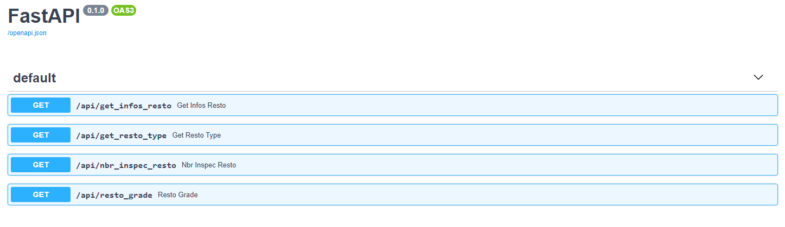
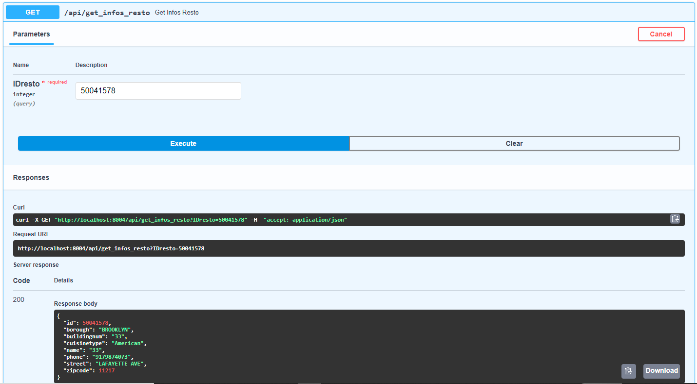

# Docker_Cassandra_FastAPI

Ce projet consiste à créer un cluster Cassandra composé de 2 noyaux, puis de créer une API pour tester l'accessibilité et le temps de réponses de la base. Les données représentent les résulats d'inspection de restaurants dans la ville de New-York.

L'API est constitué de 4 url permettant d'accéder :
* aux infos d'un restaurant à partir de son id
* à la liste des noms de restaurants à partir du type de cuisine
* au nombre d'inspection d'un restaurant à partir de son id restaurant
* les noms des 10 premiers restaurants d'un grade donné

## Création du conteneur :

Pour commencer, créer le repertoire parent puis éxécuter dans le terminal de puis ce répertoire :

* `git clone https://github.com/PaulSabia/Docker_Cassandra_FastAPI.git`

Puis éxécuter la commande suivante :

* `docker-compose up --build`

## Remplissage de la base :

* `docker cp db-schema/restaurants.csv cassandra-c01:/restaurants.csv`

* `docker cp db-schema/restaurants_inspections.csv cassandra-c01:/restaurants_inspections.csv`

Puis entrer dans le conteneur afin de pouvoir éxécuter nos requêtes CQL de création de table :

* `docker exec -it cassandra-c01 cqlsh`

L'ensemble des requêtes de création sont regroupées dans le fichier `init.cql`

## Dernière vérification :

A la création des deux conteneurs Cassandra, une ip propre leur est attribué. Ici : `172.18.0.2` et `172.18.0.3`. 

Pour obtenir l'ip (lorsque les conteneurs sont en marche): 

* `docker exec -it cassandra-c01 nodetool status`

Dans le fichier `api.py`, remplacer les ip à la ligne n° 10 :

* `cls.cluster = cluster.Cluster(['172.18.0.2', '172.18.0.3'], port=9042)`

## Test de l'API :

Relancer les conteneur : `docker-compose up --build` puis se rendre à l'adresse suivante : [http://localhost:8004/docs](http://localhost:8004/docs)

